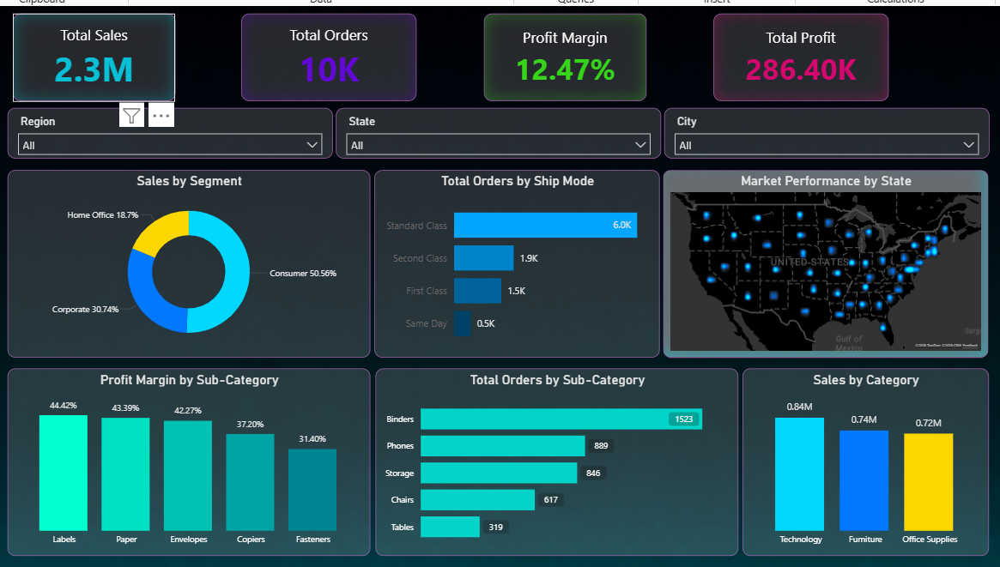

#superstore-sales-analysis
📊 Project Overview
An interactive Sales Dashboard built using Power BI to analyze and monitor the business performance of a retail superstore across regions, segments, and product categories.

🧩 Business Problem
A retail superstore was struggling to get a clear, unified view of its sales performance across multiple regions, states, and cities. Key challenges included:

Difficulty identifying which customer segments drive the most revenue
No quick way to track profit margins across product sub-categories
Lack of visibility into shipping mode preferences and their impact on order volume
Inability to spot underperforming regions or product categories at a glance

💡 Solution
Built an end-to-end interactive dashboard in Power BI that enables stakeholders to:

Monitor KPIs (Total Sales, Orders, Profit Margin, Total Profit) at a glance
Filter data dynamically by Region, State, and City
Identify top-performing and low-performing sub-categories by profit margin
Analyze order distribution by shipping mode
Visualize geographic sales performance across the US

🛠️ Tools Used

Power BI Desktop — Dashboard development
Microsoft Excel / CSV — Data source (SampleSuperstore.csv)

📁 Dataset

Source: Sample Superstore dataset (commonly used for BI practice)
Fields: Order ID, Region, State, City, Category, Sub-Category, Sales, Profit, Quantity, Ship Mode, Segment

📌 Key Insights

Consumer segment accounts for ~50% of all orders
Labels, Paper, and Envelopes have the highest profit margins (40%+)
Standard Class is the most preferred shipping mode (6K orders)
Binders lead in total orders among all sub-categories (1,523)

## 📸 Dashboard Preview

Technology is the top revenue-generating category (0.84M)

